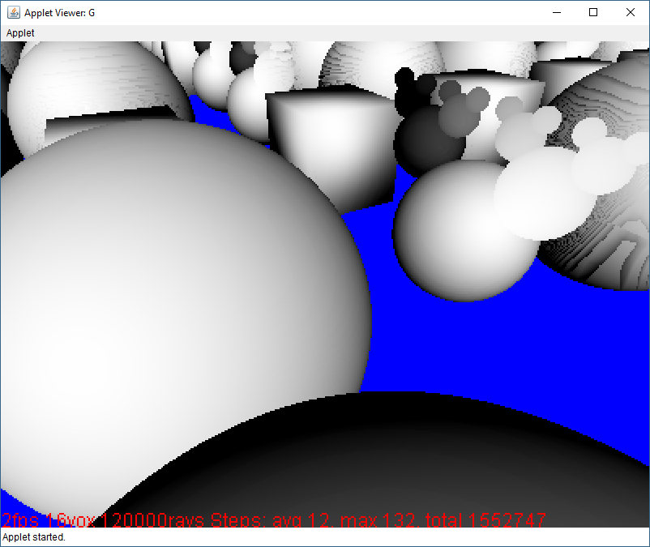

# distance-fields4k
Distance field 3D rendering demo for [Java4K 2014 competition](http://java4k.com/index.php?action=games&cid=10) (unreleased)

Geometry is defined in terms of distance to the surface, and this metric is used to trace rays against the geometry, moving along the ray as much as possible each iteration, in order to trace the geometry relatively quickly. 

# Build Status

# Screenshots

